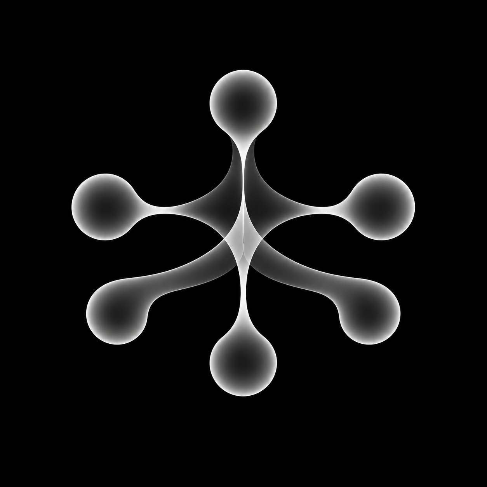

# PolyDaemon



Управляй окнами Claude Code, Codex и OpenCode из Telegram. Пишешь боту — сообщение попадает в
конкретное окно агента; ответ и ход работы возвращаются в чат. Несколько
окон одновременно, на одной машине или на нескольких.

Лаунчеры называются `polydaemon-<агент>`. Старые технические идентификаторы
`tg-bridge` сохранены для [совместимости](docs/naming.md).

> **Статус:** ранний MIT-релиз, а не вылизанный продукт. Адаптер Claude
> использует каналы Claude Code — это research preview
> (`--dangerously-load-development-channels`), и они могут измениться.
> [English version](README.md)

## Что умеет

- **Окно Claude Code, до которого можно дотянуться с телефона.** Пишешь — сообщение
  уходит в выбранное окно, ответ приходит обратно. Переписка живёт в собственной
  сессии Claude Code этого окна.
- **Топик на окно — или одна комната на всех.** В форум-группе Telegram у каждого
  окна свой топик, либо все окна в одном топике, и к нужному обращаешься `@имя`.
- **Живой прогресс.** Пока Claude работает, статусное сообщение показывает вызовы
  инструментов и то, что модель думает вслух.
- **Одобрения, вопросы и планы в Telegram.** Запросы разрешений, `AskUserQuestion`
  и подтверждение плана приходят кнопками. Одобрение, на которое никто не ответил,
  само не проходит никогда.
- **Запуск окон из Telegram** командой `/launch` — на macOS они открываются
  вкладками iTerm2, а при нескольких машинах у каждой своя вкладка в выборе.
  `/restart all` перезапускает все простаивающие окна, чтобы обновление дошло до
  всех.
- **Несколько машин, один бот.** Окна на маке и на Windows-машине отчитываются
  одному боту по твоей собственной сети.
- **Два окна, один файл.** Окно, которое собирается править файл, уже открытый
  другим окном на той же машине, получает предупреждение заранее; `/who`
  показывает, кто где работает.
- **Сжатие по простою.** Окно, простаивающее с большим контекстом, сжимается один
  раз — и если это не помогло, его больше не трогают, пока в нём не будет новой
  активности.
- **Файлы до 2 ГБ в обе стороны.** Окно может прислать тебе сборку, установщик или
  видео — до 1990 МБ с собственным сервером Bot API, где облачный API
  останавливается на 50 МБ, — а файлы от тебя приходят без ограничения размера.
  [Как](docs/large-files.md).
- **Окна Codex** — экспериментально: [docs/codex.md](docs/codex.md).
- **Окна OpenCode V2** — нативные сессии и хуки инструментов/разрешений:
  [docs/opencode.md](docs/opencode.md). V1 не поддерживается.

## Как устроено

```text
Ты в Telegram
     │  Bot API
     ▼
[telegram-bot-api]   облачный по умолчанию, или свой — для файлов до 2 ГБ
     │
     ▼  getUpdates
[Бот-роутер]  (Python)            единственный, кто читает из Telegram
     │  выбирает окно, обрабатывает /команды, сопоставляет топики с окнами
     │  HTTP → выбранное окно
     ▼
[Плагин канала]  (Bun/TS, по одному на окно) ──MCP-канал──► Claude Code
     └──────── отправляет ответ в Telegram ◄──── инструмент reply ──┘

[Хуки] одобрения · вопросы · планы · уведомления · зеркало ответов,
       из Claude Code в Telegram — работают только в окнах с плагином
```

Подробнее — [docs/architecture/system-overview.md](docs/architecture/system-overview.md).

## Как начать

**[docs/getting-started.md](docs/getting-started.md)** — всё на одной машине, по
шагам: создать бота, настроить его, зарегистрировать плагин, поставить хуки,
запустить окно, отправить первое сообщение. (Гайд на английском.)

Нужны Bun 1.3.x, Python 3.11+, Node 22.5+ и выбранный агент. Для Codex и
OpenCode установка Claude не требуется. Общие настройки бота и машины — в
гайде выше; затем настрой выбранный адаптер. Проверенные платформы и ограничения:
[docs/platforms.md](docs/platforms.md).

Для нескольких машин с одним ботом —
[docs/multi-machine.md](docs/multi-machine.md).

## Что в репозитории

| Папка | Что это |
|---|---|
| `tg-bot/` | Бот-роутер. Владеет токеном бота, единственный опрашивает Telegram, маршрутизирует в окна, держит топики и реестр окон. Точка входа — `tgbridge.py`. |
| `channel-plugin/` | MCP-сервер, который загружается в каждое окно Claude Code. Принимает сообщения от бота, передаёт их в Claude, отправляет ответы в Telegram. |
| `hooks/` | Хуки Claude Code и `install.py`, который их регистрирует. |
| `clients/` | Лаунчеры окон (`polydaemon-claude.sh` для macOS/Linux), агент запуска для каждой машины, помощники для Codex. |
| `polydaemon-claude.cmd`, `launch-ws.ps1` | Лаунчер для Windows и скрипт, который запускает окно по `/launch`. |
| `agent/` | Демон на каждой машине — для окон Codex и уборки осиротевших процессов. |
| `vscode-extension/` | Необязательно: открывает терминал с Claude и интерфейс одобрений в VS Code. |
| `docs/` | Всё остальное — см. ниже. |

## Документация

- **[С чего начать](docs/getting-started.md)** — одна машина, с нуля.
- **[Архитектура](docs/architecture/)** — плагин, бот, хуки и протокол между ними.
- **[Настройки](docs/reference/configuration.md)** — все параметры.
- **[Ранбуки](docs/runbooks/)** — разбор типичных сбоев.
- **[Решения](docs/adr/)** — архитектурные решения и их причины.
- **[Несколько машин](docs/multi-machine.md)** — один бот, окна где угодно в
  твоей сети.
- **[Windows, macOS, Linux](docs/platforms.md)** — что где работает (на английском).
- **[Компаньоны](docs/companions.md)** — HyperMnesia для памяти, Serena для навигации по коду (на английском).
- **[Большие файлы](docs/large-files.md)** — до 2 ГБ через свой сервер Bot API.

## Безопасность

Это удалённое управление шеллом. Прочитай, прежде чем запускать.

- **Бот слушается только `telegram.allowed_users`** и отказывается стартовать с
  пустым списком. Окна работают в режиме `bypassPermissions`, так что любой из
  этого списка может заставить Claude выполнить на машине любую команду.
- **Push, deploy и явный доступ к файлам вне проекта требуют согласия владельца.**
  Без ответа выполнение не разрешается. Классификатор команд не заменяет sandbox
  для косвенных операций внутри произвольных скриптов; нативные ограничения агента
  продолжают действовать.
- **Секреты не попадают в репозиторий.** `tg-bot/config.yaml` игнорируется git;
  шаблон — `config.yaml.example`. Плагин получает токен из окружения, с которым
  его запускает Claude Code.
- **Каждая точка входа плагина требует bearer-токен.** На одной машине плагины
  слушают только loopback (по умолчанию); с несколькими — адрес, который ты
  задаёшь (`TG_BRIDGE_BIND_HOST`): используй приватную сеть вроде WireGuard,
  никогда не публичный интерфейс. У реестра для нескольких машин свой токен
  регистрации, и он принимает только перечисленные тобой подсети.

## Лицензия

[MIT](LICENSE). Отдельная установка из публичных исходников, без чужой
инфраструктуры и конфигов. Память необязательна:
[HyperMnesia](docs/companions.md#hypermnesia--memory).
